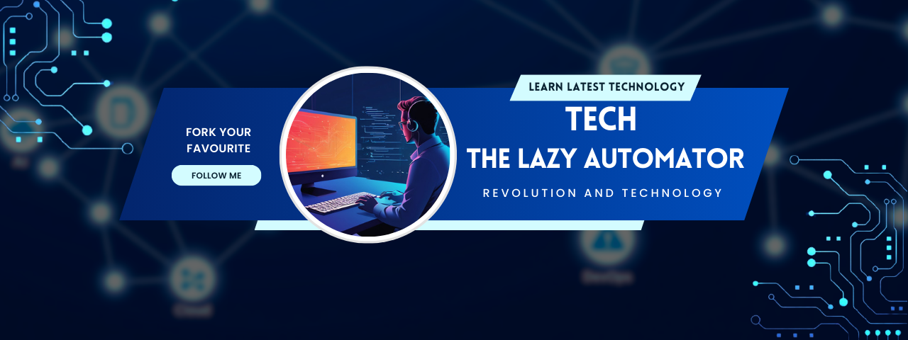

## Hi, I'm Tech!👋
#### I call myself *The Lazy Automator* because I would rather let scripts do the work while I relax.😎

I am passionate about Automating things, so I can be lazy and still get things done. I believe If you're doing the same thing twice, there's a better way.
In my channel, you will find from networking to virtualization and containerization all kind of HomeLab Automation guides in a really simple and achievable way. And for code, you can follow me here and get all the codes of practical setups that you can actually use without the unnecessary complexity. Join me on my technical journey as I turn complicated setups into straightforward solutions you can actually use.

## My Technology Stack

## My Repositories
- [HomeLab Automation Series](https://github.com/tech-the-lazy-automator/homelab-automation-series) - Code, playbooks, and configurations used in my YouTube tutorials.

- [Docker Compose Services](https://github.com/tech-the-lazy-automator/docker-compose-services) - Docker Compose files of different services for running and managing services in containers.

## Join My Community
If you run into any issues or need help to troubleshoot, or just have a quick question, [Join our community](https://discord.gg/EHcn4knGW4)! We have a dedicated Discord Community with professional individuals and experienced contributors who are always up for helping you.

### Connect With Me

